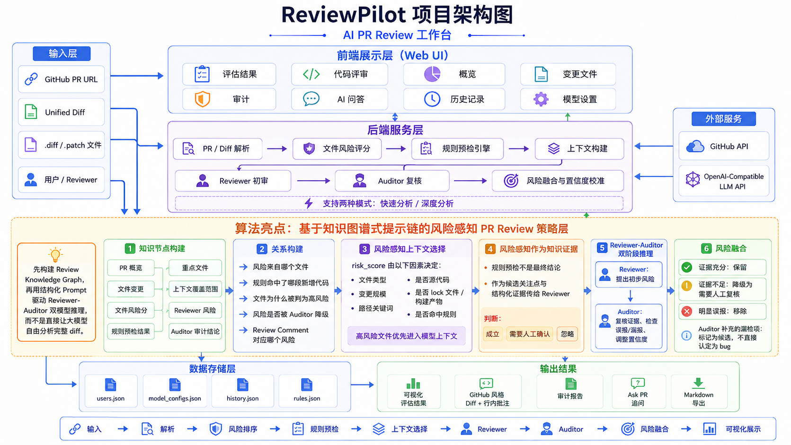

# ReviewPilot

## 1. 项目简介

ReviewPilot 是一个面向 Pull Request 的 AI 代码评审助手，帮助开发者在提交代码后快速理解变更内容、定位高风险文件，并生成可复核的 Review 建议。

项目支持 GitHub PR 链接评审、粘贴 unified diff、上传 `.diff` / `.patch` 文件，并结合风险感知分析、规则预检、Reviewer / Auditor 双模型审计、Ask PR 交互式追问和可视化审查界面，形成从输入、分析、复核到报告导出的完整 PR Review 流程。



- 技术细节见：[技术文档](docs/architecture.md)
- 需求拆解见：[需求文档](docs/需求文档.md)

## 2. Demo 链接

- 在线 Demo：待补充
- 演示视频：https://b23.tv/AEi4NFt

## 3. 项目亮点 / 原创功能

- **风险感知文件排序**：根据文件类型、变更规模和潜在影响范围，对 PR 中的变更文件进行风险排序，帮助开发者优先关注高风险部分。
- **可配置规则预检**：在大模型分析前先进行规则检查，对大文件、危险改动、配置变更等内容进行基础预警。
- **Reviewer-Auditor 双模型审计**：先由 Reviewer 生成 Review 建议，再由 Auditor 进行复核，降低误报和漏报。
- **Ask PR 交互式追问**：支持用户围绕当前 PR 继续提问，例如追问高风险文件、潜在 Bug 或修改建议。
- **历史记录与报告导出**：保存 Review 历史，支持查看过往分析结果，并导出 Markdown 报告。
- **多模型 / API Key 配置中心**：支持配置 OpenAI-Compatible 模型接口，方便接入 Qwen、DeepSeek、OpenAI 等模型服务。

### 算法亮点：基于知识图谱式提示链的风险感知 PR Review 策略层

该设计参考了 **KnowGPT: Knowledge Graph based Prompting for Large Language Models** 中“先构建知识结构，再引导大模型推理”的思想。ReviewPilot 不会直接把完整 diff 丢给大模型，而是先把 PR 信息结构化成一张 Review Knowledge Graph / Review 关系图，再让 Reviewer 与 Auditor 基于结构化关系进行两阶段推理。

相比单纯调用大模型 API，这种方式先提取 PR 的文件关系、变更类型、风险信号和上下文线索，再组织模型进行审查，有助于提升 Review 结果的可解释性，并减少误报和漏报。

## 4. 依赖说明

本项目为本地运行版本，主要需要：

- **Python 运行环境**
- **浏览器**
- **大模型 API Key**

模型调用支持 OpenAI-Compatible 接口，可接入 Qwen、DeepSeek、OpenAI 等模型服务。用户需要自行准备可用的大模型 API Key，并在系统的模型设置中配置。

为方便评审团在没有 API Key 的情况下体验项目，仓库预留了一个本地演示账号：

```text
账号：asd
密码：123456
```

说明：演示账号使用的免费 API 可能存在响应延迟，请耐心等待；如果请求超时或额度不可用，请及时更换为自己的可用 API Key。

## 5. 核心功能

- **PR 链接评审**：输入公开 GitHub PR 链接后自动获取 diff 并生成评审结果。
- **Diff / Patch 输入**：支持直接粘贴 unified diff 或上传 `.diff` / `.patch` 文件。
- **风险文件列表**：按风险等级、问题数量和人工复核优先级展示变更文件。
- **Unified Diff 阅读**：在统一代码视图中查看新增、删除、上下文代码和行内 AI 标记。
- **AI 问题卡片**：按潜在 Bug、安全风险、可维护性、测试覆盖等类型展示问题。
- **Review 操作**：支持复制 Review Comment、忽略当前问题和 Ask PR 追问。
- **Ask PR 聊天**：围绕当前 PR 继续提问，支持即时展示用户消息和 AI 生成状态。
- **深度审计**：支持 Reviewer / Auditor 双模型复核并融合最终结果。
- **历史记录**：保存过往 Review 结果，便于复盘和导出报告。
- **模型设置**：在页面中配置模型 Provider、Base URL、API Key 和模型名称。

## 6. 使用方式

启动本地服务：

```powershell
python server.py
```

打开浏览器访问：

```text
http://127.0.0.1:8770
```

登录方式：

- 使用演示账号 `asd / 123456` 登录体验。
- 或注册新账号，并在模型设置中配置自己的大模型 API Key。

发起一次 Review：

1. 输入 GitHub PR 链接，或粘贴 unified diff，或上传 `.diff` / `.patch` 文件。
2. 选择模型配置和分析模式。
3. 点击“开始评审”。
4. 在总览、代码评审、AI 问题面板和 Ask PR 中查看结果。
5. 如需沉淀评审意见，可复制 Review Comment 或导出 Markdown 报告。

## 7. 当前限制和未来优化

- 当前版本主要面向本地演示和评审场景，在线 Demo 地址待补充。
- 免费模型 API 可能存在限流、排队或超时，需要准备备用 API Key。
- 知识图谱目前是轻量级 Review 关系图，后续可继续增强跨文件依赖分析和测试影响分析。
- 大型 PR 的分块分析、增量缓存和长上下文压缩仍有优化空间。
- 后续可进一步接入 GitHub Review Comment API，实现从建议到 PR 评论的闭环。
